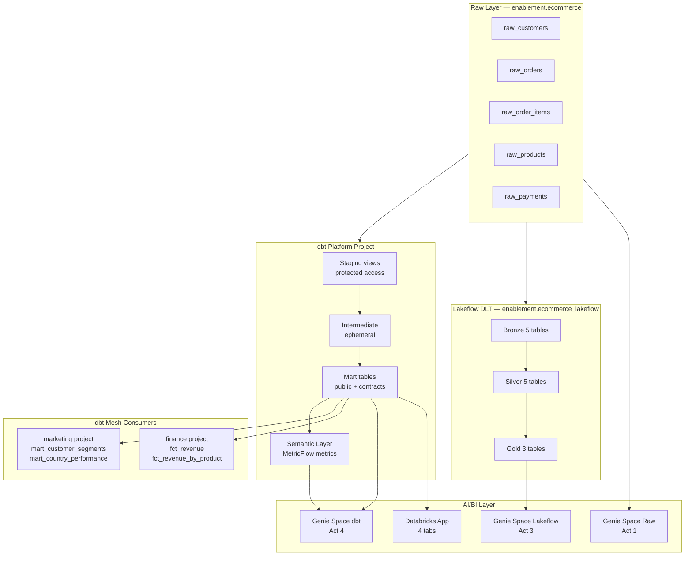

# Architecture: dbt + Databricks Reference Stack

## Overview

This repo implements the recommended reference architecture for dbt + Databricks
field demos. The architecture has three distinct layers:

1. **Ingestion layer** (Databricks Lakeflow / DLT) — Bronze/Silver
2. **Business transformation layer** (dbt Fusion) — Gold/Marts
3. **Semantic layer** (dbt MetricFlow) — Named metrics → Genie + BI

---

## ASCII Diagram

```
┌─────────────────────────────────────────────────────────────────────────┐
│                         DATABRICKS UNITY CATALOG                         │
│                                                                           │
│  ┌───────────────────┐    ┌──────────────────┐    ┌──────────────────┐  │
│  │   enablement      │    │  enablement       │    │  enablement      │  │
│  │   .ecommerce      │    │  .ecommerce_      │    │  .ecommerce_     │  │
│  │   (raw tables)    │    │  lakeflow         │    │  metric_views    │  │
│  │                   │    │  (DLT gold)       │    │  (Metric Views)  │  │
│  │  raw_customers    │    │                   │    │                  │  │
│  │  raw_orders       │    │  gold_dim_cust    │    │  total_revenue   │  │
│  │  raw_order_items  │    │  gold_fct_orders  │    │  avg_order_value │  │
│  │  raw_products     │    │  gold_fct_revenue │    │  return_rate     │  │
│  │  raw_payments     │    │                   │    │                  │  │
│  └─────────┬─────────┘    └────────┬─────────┘    └──────────────────┘  │
│            │                       │                                      │
│            │  00_setup_raw_data.py │  01_lakeflow_pipeline.py             │
│            │                       │                                      │
│            │         ┌─────────────▼─────────────────────────────────┐   │
│            └────────►│         dbt Fusion (platform project)          │   │
│                      │                                                 │   │
│                      │  STAGING (views, protected access)              │   │
│                      │    stg_customers, stg_orders, stg_order_items   │   │
│                      │    stg_products, stg_payments                   │   │
│                      │                                                 │   │
│                      │  INTERMEDIATE (ephemeral)                       │   │
│                      │    int_customer_orders                          │   │
│                      │    int_order_items_enriched                     │   │
│                      │                                                 │   │
│                      │  MARTS (tables, public access, contracts)       │   │
│                      │    dim_customers ─────────────────────────────┐ │   │
│                      │    dim_products  ─────────────────────────┐   │ │   │
│                      │    fct_orders ─────────────────────────┐  │   │ │   │
│                      │                                        │  │   │ │   │
│                      │  SEMANTIC LAYER (MetricFlow)           │  │   │ │   │
│                      │    _semantic_models.yml                │  │   │ │   │
│                      │    12+ named metrics                   │  │   │ │   │
│                      └────────────────────────────────────────│──│───│─┘   │
│                                                               │  │   │     │
│  ┌────────────────────────────────────────────────────────────▼──▼───▼──┐  │
│  │                    CONSUMER dbt PROJECTS (Mesh)                       │  │
│  │                                                                       │  │
│  │  marketing/                          finance/                        │  │
│  │    mart_customer_segments            fct_revenue                     │  │
│  │    mart_country_performance          fct_revenue_by_product          │  │
│  │    (refs platform.dim_customers,     (refs platform.fct_orders,      │  │
│  │     platform.fct_orders)              platform.dim_products)         │  │
│  └───────────────────────────────────────────────────────────────────────┘  │
│                                                                           │
│  ┌─────────────────────────────────────────────────────────────────────┐  │
│  │                        GENIE + DASHBOARDS                            │  │
│  │                                                                      │  │
│  │  Genie Space (raw)  →  ambiguous answers     (Act 1 demo)           │  │
│  │  Genie Space (DLT)  →  better but manual     (Act 3 demo)           │  │
│  │  Genie Space (dbt)  →  accurate + auditable  (Act 4 demo)           │  │
│  │  Databricks App     →  4-tab dashboard                              │  │
│  └─────────────────────────────────────────────────────────────────────┘  │
└─────────────────────────────────────────────────────────────────────────────┘
```

---

## Mermaid Diagram



---

## Key Design Decisions

### Why three Genie Spaces?

The 5-act demo requires showing Genie quality improving at each stage.
Three spaces allow the audience to compare answers to identical questions.
Using separate spaces (rather than one space with all tables) prevents Genie
from using the dbt mart metadata to answer questions about raw tables.

### Why `access: public` on marts only?

dbt Mesh requires `access: public` for cross-project refs. Staging and intermediate
models are `protected` — they can only be referenced within the platform project.
This enforces that consumers always use the clean, tested, contract-enforced mart layer.

### Why `persist_docs`?

The `dbt-databricks` adapter's `persist_docs` feature pushes YAML descriptions into
Unity Catalog column metadata. This means:
- Genie reads column descriptions natively without manual copy-paste
- Data Explorer shows meaningful descriptions to all users
- The documentation is always in sync with the code

### Why both Lakeflow and dbt in the same demo?

The demo is more credible when it shows Lakeflow honestly — acknowledging what it
does well (medallion architecture, streaming, auto-lineage) before showing what
dbt adds (governance, testing, semantic layer). Customers trust a fair comparison
more than a one-sided pitch.
