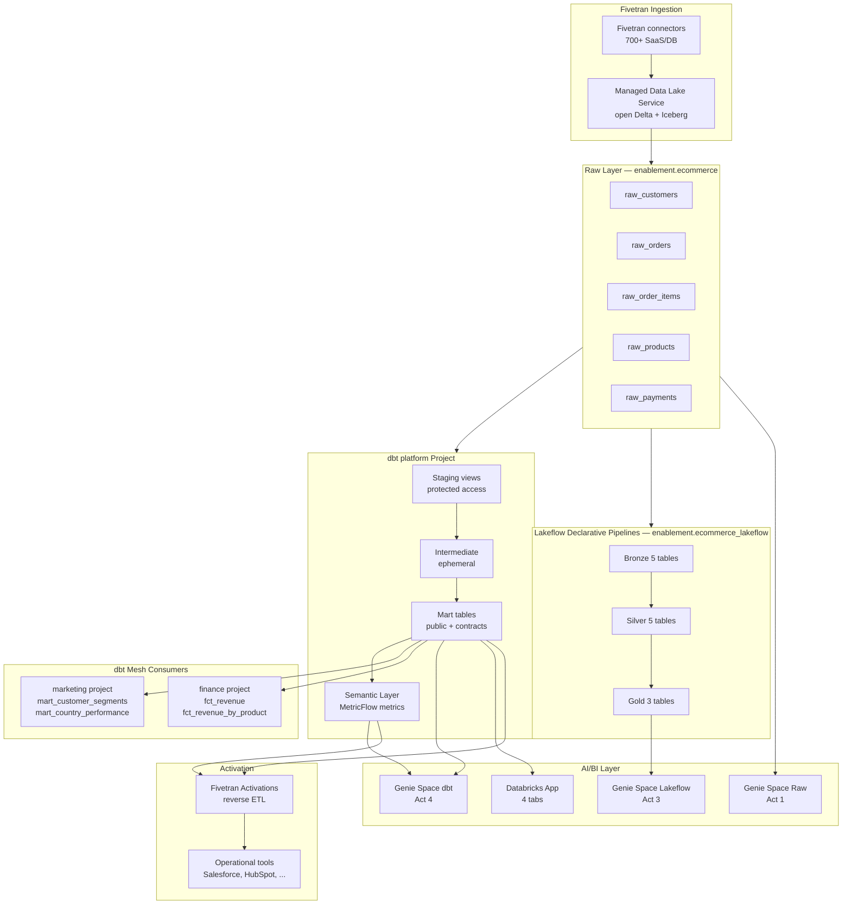

# Architecture: dbt + Databricks Reference Stack

## Overview

This repo implements the recommended reference architecture for dbt + Databricks
field demos. Since the **Fivetran + dbt Labs merger (2026-06-01)** the reference is a
complete governed loop — ingest, govern, activate — on the Databricks lakehouse:

1. **Ingestion layer** — Fivetran (700+ connectors) + the **Managed Data Lake
   Service** landing open Delta/Iceberg tables in Unity Catalog, and/or Databricks
   Lakeflow Declarative Pipelines for streaming/Spark-native sources
2. **Business transformation layer** (dbt Fusion) — Gold/Marts, contracts, tests
3. **Semantic layer** (dbt MetricFlow + UC metric views) — governed metrics → Genie,
   BI, and AI agents
4. **Activation layer** — Fivetran Activations (reverse ETL) syncs governed outputs
   back to operational tools (Salesforce, HubSpot, …)

See `FIVETRAN_DBT_DATABRICKS.md` for the competitive positioning of this loop.

### End-to-end loop

```
Fivetran ingest + MDLS ─▶ Unity Catalog (open Delta/Iceberg) ─▶ dbt Fusion (govern)
        ▲                                                              │
        │                                                              ▼
 operational tools ◀── Fivetran Activations ◀── Databricks AI (Genie/agents) consume
```

The detailed lakehouse layout below focuses on the transform/govern core; the
ingestion (Fivetran/Lakeflow) and activation (Fivetran Activations) ends wrap it.

---

## ASCII Diagram

```
┌─────────────────────────────────────────────────────────────────────────┐
│                         DATABRICKS UNITY CATALOG                         │
│                                                                           │
│  ┌───────────────────┐    ┌──────────────────┐    ┌──────────────────┐  │
│  │   enablement      │    │  enablement       │    │  enablement      │  │
│  │   .ecommerce      │    │  .ecommerce_      │    │  .ecommerce_     │  │
│  │   (raw tables)    │    │  lakeflow         │    │  metric_views    │  │
│  │                   │    │  (Lakeflow gold)       │    │  (Metric Views)  │  │
│  │  raw_customers    │    │                   │    │                  │  │
│  │  raw_orders       │    │  gold_dim_cust    │    │  total_revenue   │  │
│  │  raw_order_items  │    │  gold_fct_orders  │    │  avg_order_value │  │
│  │  raw_products     │    │  gold_fct_revenue │    │  return_rate     │  │
│  │  raw_payments     │    │                   │    │                  │  │
│  └─────────┬─────────┘    └────────┬─────────┘    └──────────────────┘  │
│            │                       │                                      │
│            │  00_setup_raw_data.py │  01_lakeflow_pipeline.py             │
│            │                       │                                      │
│            │         ┌─────────────▼─────────────────────────────────┐   │
│            └────────►│         dbt Fusion (platform project)          │   │
│                      │                                                 │   │
│                      │  STAGING (views, protected access)              │   │
│                      │    stg_customers, stg_orders, stg_order_items   │   │
│                      │    stg_products, stg_payments                   │   │
│                      │                                                 │   │
│                      │  INTERMEDIATE (ephemeral)                       │   │
│                      │    int_customer_orders                          │   │
│                      │    int_order_items_enriched                     │   │
│                      │                                                 │   │
│                      │  MARTS (tables, public access, contracts)       │   │
│                      │    dim_customers ─────────────────────────────┐ │   │
│                      │    dim_products  ─────────────────────────┐   │ │   │
│                      │    fct_orders ─────────────────────────┐  │   │ │   │
│                      │                                        │  │   │ │   │
│                      │  SEMANTIC LAYER (MetricFlow)           │  │   │ │   │
│                      │    _semantic_models.yml                │  │   │ │   │
│                      │    12+ named metrics                   │  │   │ │   │
│                      └────────────────────────────────────────│──│───│─┘   │
│                                                               │  │   │     │
│  ┌────────────────────────────────────────────────────────────▼──▼───▼──┐  │
│  │                    CONSUMER dbt PROJECTS (Mesh)                       │  │
│  │                                                                       │  │
│  │  marketing/                          finance/                        │  │
│  │    mart_customer_segments            fct_revenue                     │  │
│  │    mart_country_performance          fct_revenue_by_product          │  │
│  │    (refs platform.dim_customers,     (refs platform.fct_orders,      │  │
│  │     platform.fct_orders)              platform.dim_products)         │  │
│  └───────────────────────────────────────────────────────────────────────┘  │
│                                                                           │
│  ┌─────────────────────────────────────────────────────────────────────┐  │
│  │                        GENIE + DASHBOARDS                            │  │
│  │                                                                      │  │
│  │  Genie Space (raw)  →  ambiguous answers     (Act 1 demo)           │  │
│  │  Genie Space (Lakeflow)  →  better but manual     (Act 3 demo)           │  │
│  │  Genie Space (dbt)  →  accurate + auditable  (Act 4 demo)           │  │
│  │  Databricks App     →  4-tab dashboard                              │  │
│  └─────────────────────────────────────────────────────────────────────┘  │
└─────────────────────────────────────────────────────────────────────────────┘
```

---

## Mermaid Diagram


```mermaid
flowchart TD
    subgraph Raw["Raw Layer — enablement.ecommerce"]
        R1[raw_customers]
        R2[raw_orders]
        R3[raw_order_items]
        R4[raw_products]
        R5[raw_payments]
    end

    subgraph Lakeflow["Lakeflow Declarative Pipelines — enablement.ecommerce_lakeflow"]
        B[Bronze 5 tables]
        S[Silver 5 tables]
        G[Gold 3 tables]
        B --> S --> G
    end

    subgraph Platform["dbt platform Project"]
        STG[Staging views\nprotected access]
        INT[Intermediate\nephemeral]
        MARTS[Mart tables\npublic + contracts]
        SEM[Semantic Layer\nMetricFlow metrics]
        STG --> INT --> MARTS
        MARTS --> SEM
    end

    subgraph Mesh["dbt Mesh Consumers"]
        MKT[marketing project\nmart_customer_segments\nmart_country_performance]
        FIN[finance project\nfct_revenue\nfct_revenue_by_product]
    end

    subgraph AI["AI/BI Layer"]
        G1[Genie Space Raw\nAct 1]
        G2[Genie Space Lakeflow\nAct 3]
        G3[Genie Space dbt\nAct 4]
        APP[Databricks App\n4 tabs]
    end

    subgraph Ingest["Fivetran Ingestion"]
        FT[Fivetran connectors\n700+ SaaS/DB]
        MDLS[Managed Data Lake Service\nopen Delta + Iceberg]
        FT --> MDLS
    end

    subgraph Activate["Activation"]
        ACT[Fivetran Activations\nreverse ETL]
        OPS[Operational tools\nSalesforce, HubSpot, ...]
        ACT --> OPS
    end

    MDLS --> Raw
    Raw --> Platform
    Raw --> Lakeflow
    MARTS --> MKT
    MARTS --> FIN
    Raw --> G1
    G --> G2
    MARTS --> G3
    SEM --> G3
    MARTS --> APP
    MARTS --> ACT
    SEM --> ACT
```

---

## Key Design Decisions

### Why three Genie Spaces?

The 5-act demo requires showing Genie quality improving at each stage.
Three spaces allow the audience to compare answers to identical questions.
Using separate spaces (rather than one space with all tables) prevents Genie
from using the dbt mart metadata to answer questions about raw tables.

### Why `access: public` on marts only?

dbt Mesh requires `access: public` for cross-project refs. Staging and intermediate
models are `protected` — they can only be referenced within the platform project.
This enforces that consumers always use the clean, tested, contract-enforced mart layer.

### Why `persist_docs`?

The `dbt-databricks` adapter's `persist_docs` feature pushes YAML descriptions into
Unity Catalog column metadata. This means:
- Genie reads column descriptions natively without manual copy-paste
- Data Explorer shows meaningful descriptions to all users
- The documentation is always in sync with the code

### Why both Lakeflow and dbt in the same demo?

The demo is more credible when it shows Lakeflow honestly — acknowledging what it
does well (medallion architecture, streaming, auto-lineage) before showing what
dbt adds (governance, testing, semantic layer). Customers trust a fair comparison
more than a one-sided pitch.

### Why Fivetran + MDLS at the front and Activations at the end?

Post-merger, one company covers the whole loop. Fivetran connectors + the Managed
Data Lake Service land open Delta/Iceberg tables in Unity Catalog faster than
hand-building ingestion (the standout for Iceberg/open-format customers), and
Fivetran Activations closes the loop by syncing governed dbt outputs back to
operational tools — a capability Databricks has no first-class native answer for.
Lakeflow remains in the picture for streaming/Spark-native sources; the two are
complementary. See `FIVETRAN_DBT_DATABRICKS.md`.
